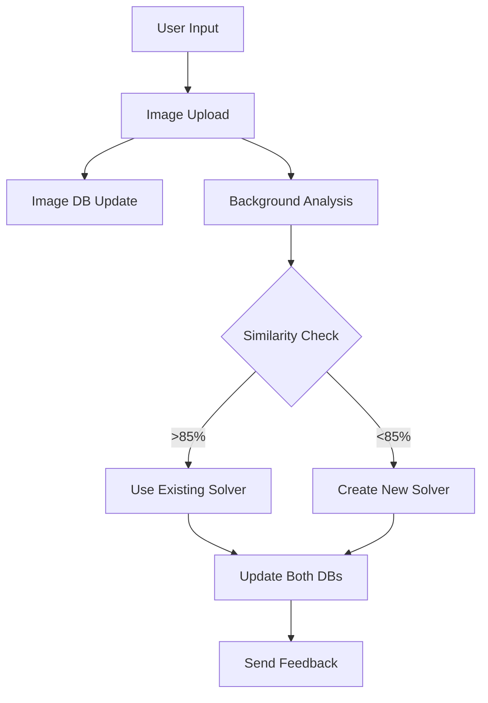
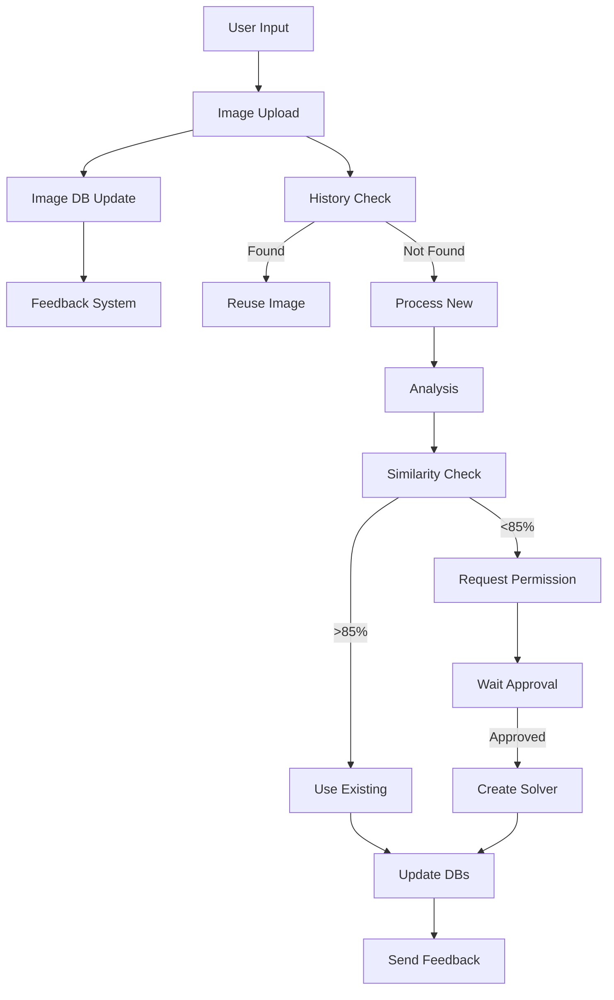
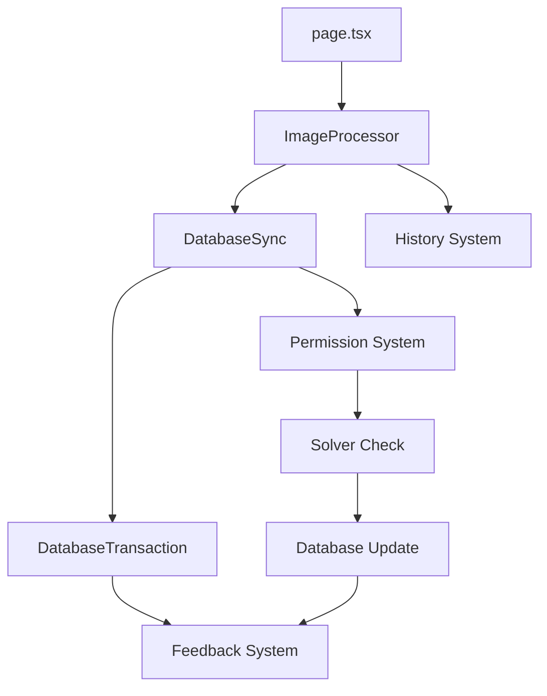
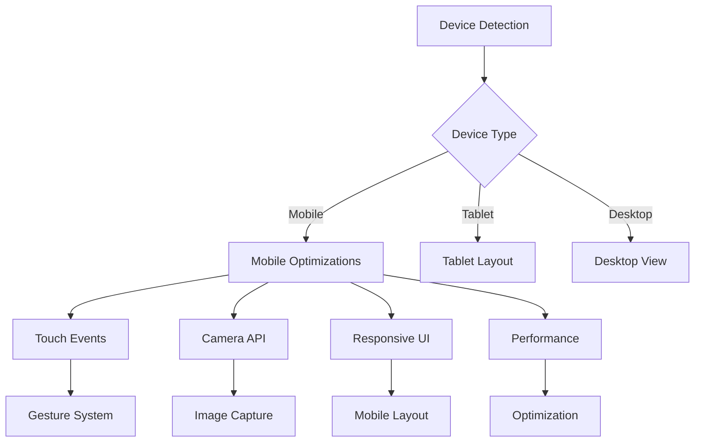

# Hair Education Project Directory Structure

## Root Directory
```
hair-education/
├── src/               # Source code directory
├── public/            # Static assets
├── course_layout.md   # Detailed course curriculum documentation
├── lastdone.md        # Session progress tracking
├── openai_solution.md # Comprehensive solution documentation
├── Course Content/    # Educational content
│   ├── basic level/    # Basic level materials
│   │   └── deepinfo.txt           # Basic level detailed information
│   ├── Intermediate Level/ # Intermediate materials
│   │   ├── Application & Te.txt   # Intermediate level applications
│   │   ├── deepinfo.txt           # Intermediate level information
│   │   ├── deepinfo2.txt          # Additional intermediate content
│   │   └── deepinfo3.txt          # Extended intermediate content
│   └── Expert Level/       # Expert level materials
│       └── Advanced Techniques.txt # Expert level techniques
│
├── .gitignore           # Git ignore rules
├── tailwind.config.ts   # Tailwind configuration
├── postcss.config.js    # PostCSS configuration
└── package.json         # Project dependencies and scripts
```

## Source Code Structure (`src/`)

### App Directory (`src/app/`)
Core application pages and routing:

- `_utils/` 
  - `supabase-server.ts` 
    - Supabase server utilities
- `auth/` 
  - `callback/` 
    - Authentication callback handling
- `globals.css` 
  - Global styles
- `page.tsx` 
  - Main landing page
  - Features navigation cards for different course levels
  - Gradient background with modern UI
  - Purpose: Entry point and course level selection

- `beginner-chapter1/` 
  - Chapter 1 content
- `beginner/page.tsx` 
  - Beginner level course content
  - Pink theme with 5 detailed modules
  - Features interactive elements and course overview
  - Purpose: Deliver foundational hair education content

- `intermediate/page.tsx` 
  - Intermediate level course content
  - Purple theme with 5 advanced modules
  - Professional techniques and application methods
  - Purpose: Advanced application and technique training

- `expert/page.tsx` 
  - Expert level course content
  - Blue theme with 5 specialized modules
  - Advanced techniques and business management
  - Purpose: Master-level education and business skills

- `contact/page.tsx` 
  - Contact form and information
  - Professional communication channel
  - Purpose: Student support and inquiries

### Components Directory (`src/components/`)
Reusable UI components:

- `HomeButton.tsx` 
  - Navigation component
  - Fixed position in top-left corner
  - Pink gradient styling
  - Purpose: Consistent navigation back to home page

- `PDFViewer/` 
  - PDF viewing components
  - Purpose: Display course materials and resources

- `ImageProcessor/` 
  - Image processing components
  - Purpose: Handle image uploads and processing

### Styles Directory (`src/styles/`)
Global styling and theme definitions:

- `globals.css` 
  - Global CSS styles
  - Tailwind CSS utilities
  - Custom color schemes
  - Purpose: Consistent styling across the application

### Utils Directory (`src/utils/`)
Utility functions:

- `supabase.ts` 
  - Supabase client
  - Purpose: Handle database interactions

- `logger.ts` 
  - Logging utilities
  - Purpose: Log application events

- `DatabaseTransaction.ts` 
  - Transaction handling
  - Purpose: Manage database transactions

- `type_conversion.ts` 
  - Type safety utilities
  - Purpose: Ensure type safety in the application

### Types Directory (`src/types/`)
TypeScript type definitions:

- Purpose: Define types for the application

## Documentation Files

- `course_layout.md` 
  - Comprehensive course curriculum
  - Detailed module descriptions
  - Learning objectives and assessments
  - Purpose: Course content reference and planning

- `Hair_project_directories.md` (this file)
  - Project structure documentation
  - File and directory explanations
  - Purpose: Development reference and maintenance

- `lastdone.md` 
  - Session progress tracking
  - Completed tasks and current status
  - Next steps and priorities
  - Outstanding issues
  - Purpose: Development continuity between sessions

- `openai_solution.md` 
  - Comprehensive solution documentation
  - Device Detection
  - PDF Processing
  - Database Integration (Supabase)
  - Error Handling
  - Image Processing
  - Transaction System
  - Type Safety Implementation
  - Purpose: Solution documentation and reference

## Configuration Files

- `package.json` 
  - Project dependencies
  - Build scripts
  - Development tools
  - Purpose: Project configuration and dependency management

- `tailwind.config.ts` 
  - Tailwind CSS configuration
  - Custom theme settings
  - Color schemes and responsive design
  - Purpose: Styling framework configuration

- `next.config.js` 
  - Next.js configuration
  - Build settings
  - Environment variables
  - Purpose: Framework configuration

## Version Control

- `.gitignore` 
  - Excludes node_modules
  - Ignores build artifacts
  - Skips environment files
  - Purpose: Version control management

## Development Notes

1. **Component Organization**
   - All reusable components go in `src/components/`
   - Page-specific components stay in their page directories
   - Maintain consistent naming conventions

2. **Styling Approach**
   - Use Tailwind CSS for styling
   - Maintain theme consistency per level:
     - Beginner: Pink theme
     - Intermediate: Purple theme
     - Expert: Blue theme

3. **Documentation**
   - Keep documentation files updated
   - Document any new components or features
   - Maintain clear code comments

4. **Best Practices**
   - Follow Next.js conventions
   - Implement responsive design
   - Optimize for performance
   - Maintain accessibility standards

## Recent Updates (After January 28, 2025)

### New Files and Major Updates

```
hair-education/
├── src/
│   ├── __tests__/                # Test directory
│   │   ├── ImageProcessing.test.ts  # Image processing tests
│   │   ├── TutorialStore.ts      # Tutorial store tests
│   │   └── Processor.test.ts     # Processor tests
│   │
│   ├── app/
│   │   ├── _utils/
│   │   │   └── supabase-server.ts # Supabase server utilities
│   │   ├── auth/
│   │   │   └── callback/         # Authentication callback handling
│   │   ├── globals.css           # Global styles
│   │   └── supabase-server.ts    # Main Supabase server config
│   └── utils/
│       └── logger.ts             # Logging utilities
│
├── Course Content/
│   ├── basic level/
│   │   └── deepinfo.txt         # Basic level information
│   ├── Intermediate Level/
│   │   ├── Application & Te.txt # Intermediate applications
│   │   ├── deepinfo.txt         # Intermediate information
│   │   ├── deepinfo2.txt        # Additional content
│   │   └── deepinfo3.txt        # Extended content
│   └── Expert Level/
│       └── Advanced Techniques.txt # Expert techniques
│
├── openai_solution.md          # Solution documentation
├── .gitignore                 # Git ignore configuration
├── tailwind.config.ts         # Tailwind CSS configuration
├── postcss.config.js          # PostCSS configuration
└── package.json         # Project dependencies and scripts
```

### Modified Components

1. Database System
   - Added Supabase integration
   - Implemented transaction handling
   - Added dual database consistency
   - Added server-side Supabase utilities
   - Added authentication callback handling

2. Image Processing
   - Added immediate upload functionality
   - Implemented 3-hour history system
   - Added solver similarity check
   - Added logging system
   - Added comprehensive tests

3. Error Handling
   - Added comprehensive error tracking
   - Implemented feedback system
   - Added type safety for tuples
   - Added logging utilities
   - Added test coverage

4. Performance
   - Added memory management
   - Implemented cleanup strategies
   - Added performance monitoring
   - Added PostCSS and Tailwind optimizations

5. Testing
   - Added image processing tests
   - Added tutorial store tests
   - Added processor tests
   - Added test utilities

6. Styling
   - Added Tailwind CSS configuration
   - Added global CSS styles
   - Added PostCSS configuration

7. Documentation
   - Added basic level documentation
   - Added intermediate level documentation
   - Added expert level documentation
   - Added OpenAI solution documentation

## Directory Structure (Updated February 1, 2025)
```
hair-education/
├── src/                        # Source code directory
│   ├── __tests__/             # Test directory
│   │   ├── ImageProcessing.test.ts
│   │   ├── TutorialStore.ts
│   │   └── Processor.test.ts
│   │
│   ├── app/                   # Next.js app directory
│   │   ├── _utils/           # App utilities
│   │   │   └── supabase-server.ts
│   │   ├── auth/             # Authentication
│   │   │   └── callback/     # Auth callbacks
│   │   ├── beginner-chapter1/ # Chapter 1 content
│   │   ├── globals.css       # Global styles
│   │   └── page.tsx         # Main page component
│   │
│   ├── components/          # React components
│   │   ├── PDFViewer/      # PDF viewing components
│   │   └── ImageProcessor/ # Image processing components
│   │
│   └── utils/              # Utility functions
│       ├── supabase.ts     # Supabase client
│       ├── logger.ts       # Logging utilities
│       ├── DatabaseTransaction.ts # Transaction handling
│       └── type_conversion.ts # Type safety utilities
│
├── Course Content/         # Educational content
│   ├── basic level/       # Basic level materials
│   ├── Intermediate Level/ # Intermediate materials
│   └── Expert Level/      # Expert level materials
│
├── public/                # Static assets
├── course_layout.md      # Course curriculum documentation
├── lastdone.md          # Session progress tracking
├── openai_solution.md   # Solution documentation
├── .gitignore          # Git ignore rules
├── tailwind.config.ts  # Tailwind configuration
├── postcss.config.js   # PostCSS configuration
└── package.json        # Project dependencies and scripts
```

## Detailed File Descriptions

### Core Processing Files

- `utils/pdf_processor.ts`
  - Purpose: Handles PDF processing and image extraction
  - Key Features:
    - Synchronous PDF processing
    - Memory-efficient image extraction
    - XRef-based image handling
    - Proper metadata structure creation
    - Database storage integration
  - Dependencies: fitz, supabase

- `utils/image_processor.ts`
  - Purpose: Manages image processing and database updates
  - Key Features:
    - Immediate image upload
    - Dual database updates (image and solver)
    - 3-hour image history
    - Solver similarity checks (85% threshold)
    - Transaction handling
  - Dependencies: supabase, type_conversion

- `utils/DatabaseTransaction.ts`
  - Purpose: Ensures atomic database operations
  - Key Features:
    - Transaction management
    - Rollback support
    - Consistency checks
    - Error handling
    - Separate feedback for each database
  - Dependencies: supabase

### Test Files

- `__tests__/ImageProcessing.test.ts`
  - Purpose: Tests image processing functionality
  - Coverage:
    - Image upload
    - Database updates
    - History retrieval
    - Solver checks
    - Error cases
  - Dependencies: jest, supabase-js

- `__tests__/TutorialStore.ts`
  - Purpose: Tests tutorial state management
  - Coverage:
    - State updates
    - Navigation
    - Progress tracking
    - Error handling
  - Dependencies: jest, zustand

- `__tests__/Processor.test.ts`
  - Purpose: Tests PDF and image processors
  - Coverage:
    - PDF extraction
    - Image conversion
    - Memory management
    - Database integration
  - Dependencies: jest, fitz

### Server Files

- `app/_utils/supabase-server.ts`
  - Purpose: Server-side Supabase configuration
  - Features:
    - Authentication
    - Server-side queries
    - Error handling
    - Type safety
  - Dependencies: supabase-js

- `app/auth/callback/*`
  - Purpose: Authentication callback handling
  - Features:
    - OAuth callbacks
    - Session management
    - Error handling
    - Redirect logic
  - Dependencies: next-auth

### Utility Files

- `utils/type_conversion.ts`
  - Purpose: Type safety and conversion
  - Features:
    - Tuple index handling
    - Type validation
    - Error prevention
    - Safe conversions
  - Dependencies: typescript

- `utils/logger.ts`
  - Purpose: Application logging
  - Features:
    - Error tracking
    - Performance monitoring
    - Database feedback
    - Debug information
  - Dependencies: winston

### Style Files

- `app/globals.css`
  - Purpose: Global styles
  - Features:
    - Tailwind imports
    - Custom variables
    - Base styles
    - Utility classes
  - Dependencies: tailwindcss

- `tailwind.config.ts`
  - Purpose: Tailwind configuration
  - Features:
    - Theme customization
    - Plugin configuration
    - Responsive design
    - Dark mode
  - Dependencies: tailwindcss

- `postcss.config.js`
  - Purpose: PostCSS configuration
  - Features:
    - Plugin setup
    - Tailwind integration
    - Autoprefixer
    - Optimization
  - Dependencies: postcss

### Documentation Files

- `openai_solution.md`
  - Purpose: Solution documentation
  - Contents:
    - Implementation details
    - Database schema
    - API documentation
    - Testing guide
    - Performance notes

### Content Files

- `Course Content/basic level/deepinfo.txt`
  - Purpose: Basic level course content
  - Topics:
    - Fundamentals
    - Core concepts
    - Basic techniques
    - Practice exercises

- `Course Content/Intermediate Level/*.txt`
  - Purpose: Intermediate level content
  - Topics:
    - Advanced concepts
    - Professional techniques
    - Real-world applications
    - Case studies

- `Course Content/Expert Level/Advanced Techniques.txt`
  - Purpose: Expert level content
  - Topics:
    - Master techniques
    - Business strategies
    - Advanced problem-solving
    - Industry best practices

## Error Handling Files

- `app/beginner/error.tsx`
  - Purpose: Error boundary for beginner section
  - Features:
    - Graceful error handling
    - User-friendly error messages
    - Error reporting to logger
    - Recovery options
  - Dependencies: react, logger

- `app/intermediate-chapter1/not-found.tsx`
  - Purpose: 404 page for intermediate chapter
  - Features:
    - Custom 404 message
    - Navigation suggestions
    - Search functionality
    - Error reporting
  - Dependencies: next.js

### Database Files

- `utils/databaseSync.ts`
  - Purpose: Database synchronization
  - Features:
    - Dual database updates
    - Transaction handling
    - 3-hour history tracking
    - Solver similarity check (85%)
    - Immediate image upload
  - Dependencies: supabase, DatabaseTransaction

### Tutorial Pages

- `app/tutorial/beginner/chapter1/page.tsx`
  - Purpose: Beginner chapter 1 content
  - Features:
    - Interactive lessons
    - Image upload
    - Analysis integration
    - Progress tracking
    - Mobile optimization
  - Dependencies: next.js, ImageProcessor

### Public Files

- `public/manifest.json`
  - Purpose: Progressive Web App manifest
  - Features:
    - App metadata
    - Icons and themes
    - Display settings
    - Installation properties
  - Dependencies: none

## Main Page Components

- `app/beginner-chapter1/page.tsx`
  - Purpose: Main entry point for image analysis
  - Key Features:
    - Image input field
    - Paste functionality
    - Drag and drop support
    - Immediate upload
    - Progress tracking
  - Image Flow:
    1. User inputs image (paste/drop)
    2. Immediate upload to image database
    3. Background analysis starts
    4. Routing based on analysis
  - Dependencies: ImageProcessor, DatabaseSync

## Database Synchronization

- `utils/databaseSync.ts`
  - Purpose: Manage dual database updates
  - Update Flow:
    1. Image Database Update:
       - Immediate upload
       - Store raw image
       - Create metadata
       - Generate hash
       - Set 3-hour retention
    2. Solver Database Update:
       - Check similarity (85% threshold)
       - Create/link solver
       - Store analysis results
       - Update status
    3. Feedback System:
       - Separate status for each database
       - Error tracking
       - Success confirmation
  - Key Features:
    - Atomic transactions
    - Rollback support
    - History tracking
    - Error recovery
    - Status monitoring
  - Dependencies:
    - Supabase
    - DatabaseTransaction
    - Logger
    - TypeConversion

## Integration Flow



## Directory Structure (Updated February 1, 2025)
```
hair-education/
├── src/                        # Source code directory
│   ├── app/                    # Next.js app directory
│   │   ├── beginner/          # Beginner section
│   │   │   └── error.tsx      # Error handling
│   │   ├── intermediate-chapter1/ # Intermediate chapter
│   │   │   └── not-found.tsx  # 404 handling
│   │   ├── tutorial/          # Tutorial section
│   │   │   └── beginner/      # Beginner tutorials
│   │   │       └── chapter1/  # Chapter 1
│   │   │           └── page.tsx # Chapter content
│   │   └── ...               # Other app files
│   │
│   └── utils/                # Utility functions
│       ├── databaseSync.ts   # Database sync
│       └── ...              # Other utilities
│
├── public/                   # Static assets
│   ├── manifest.json        # PWA manifest
│   └── ...                 # Other public files
│
└── ...                     # Other project files
```

## Future Additions

1. **Planned Directories**
   - `src/lib/` - Utility functions and helpers
   - `src/hooks/` - Custom React hooks
   - `src/context/` - React context providers

2. **Upcoming Features**
   - User authentication
   - Course progress tracking
   - Interactive assessments
   - Media content management

## Deployment & Domain Configuration

### Domain Structure
- Primary domain: `faisaljadoon.com`
  - Main website access
  - SSL protected
  - Assigned to production

- WWW domain: `www.faisaljadoon.com`
  - Redirects to primary domain
  - SSL protected
  - Configured for redirection

- Development domain: `hair-education.vercel.app`
  - Vercel preview deployments
  - Development testing
  - Staging environment

### Deployment Configuration
- Vercel hosting platform
- Automatic deployments from main branch
- Environment variables managed in Vercel dashboard
- SSL/TLS certificates auto-managed
- DNS configuration through Cloudflare

## Critical Systems Documentation

### Database Feedback System

```typescript
// Structure of database feedback
interface DatabaseFeedback {
  success: boolean;
  database: 'image' | 'solver';
  operation: 'create' | 'update' | 'delete';
  timestamp: number;
  details: any;
  error?: string;
}

// Example feedback flow:
1. Image Database Update:
   ```json
   {
     "success": true,
     "database": "image",
     "operation": "create",
     "timestamp": 1643673600000,
     "details": {
       "imageId": "img_123",
       "size": 1024,
       "format": "jpeg"
     }
   }
   ```

2. Solver Database Update:
   ```json
   {
     "success": true,
     "database": "solver",
     "operation": "create",
     "timestamp": 1643673600100,
     "details": {
       "solverId": "solver_456",
       "similarity": 87,
       "type": "curly"
     }
   }
   ```
```

### Image History System

```typescript
// 3-Hour Image History
interface ImageHistory {
  imageId: string;
  url: string;
  uploadTime: number;
  expiryTime: number;  // uploadTime + 3 hours
  metadata: {
    hash: string;
    size: number;
    format: string;
  };
}

// History retrieval flow:
1. Check image hash in last 3 hours
2. If found, reuse existing image
3. If not found, proceed with upload
4. Cleanup expired images automatically
```

### Solver Permission System

```typescript
// Solver creation permission
interface SolverPermission {
  canCreate: boolean;
  similarityThreshold: number;  // 85%
  requiresApproval: boolean;
  approvalReason?: string;
}

// Permission check flow:
1. Check similarity with existing solvers
2. If similarity > 85%:
   - Use existing solver
   - No permission needed
3. If similarity < 85%:
   - Request permission
   - Provide reason
   - Wait for approval
4. After approval:
   - Create new solver
   - Update both databases
```

### System Integration Diagram



### File Relationships



### Key System Rules

1. **Database Updates**:
   - ALWAYS update both databases
   - ALWAYS provide separate feedback
   - ALWAYS use transactions
   - ALWAYS handle errors

2. **Image History**:
   - ALWAYS check 3-hour history first
   - ALWAYS cleanup expired images
   - ALWAYS maintain metadata
   - ALWAYS use image hash

3. **Solver Creation**:
   - NEVER create without permission
   - ALWAYS check similarity first
   - ALWAYS provide reason
   - ALWAYS wait for approval

4. **Error Handling**:
   - ALWAYS rollback on failure
   - ALWAYS provide error details
   - ALWAYS log errors
   - ALWAYS notify user

## Mobile Device Optimizations

### Device Detection System

```typescript
// Device detection interface
interface DeviceInfo {
  type: 'mobile' | 'tablet' | 'desktop';
  browser: string;
  os: string;
  isBot: boolean;
  screen: {
    width: number;
    height: number;
    orientation: 'portrait' | 'landscape';
  };
}

// Implementation using ua-parser-js
const deviceDetection = new UAParser();
```

### Mobile-Specific Features

1. **PDF Handling**:
   - Optimized chunk size for mobile
   - Touch-friendly navigation
   - Pinch-to-zoom support
   - Memory-efficient loading
   - Automatic quality adjustment

2. **Image Processing**:
   - Mobile camera integration
   - Image compression
   - Preview optimization
   - Background upload
   - Progress indicators

3. **UI Adaptations**:
   - Responsive design
   - Touch-friendly buttons
   - Mobile-first layout
   - Swipe gestures
   - Bottom navigation

4. **Performance**:
   - Lazy loading
   - Image optimization
   - Code splitting
   - Resource caching
   - Reduced bundle size

### Mobile Event Handlers

```typescript
// Touch gesture handling
interface GestureHandlers {
  onPinch: (scale: number) => void;
  onSwipe: (direction: 'left' | 'right') => void;
  onTap: (position: { x: number; y: number }) => void;
  onDoubleTap: () => void;
}

// Resize handling with debounce
const handleResize = debounce(() => {
  updateLayout();
  recalculateImageSize();
  adjustUIElements();
}, 150);
```

### Mobile-Specific Routes

```typescript
// Route configuration based on device
const routeConfig = {
  mobile: {
    layout: 'stack',
    transition: 'slide',
    navigation: 'bottom'
  },
  tablet: {
    layout: 'split',
    transition: 'fade',
    navigation: 'side'
  },
  desktop: {
    layout: 'full',
    transition: 'none',
    navigation: 'top'
  }
};
```

### Mobile Integration Diagram



### Key System Rules

1. **Device Detection**:
   - ALWAYS detect device type
   - ALWAYS handle orientation changes
   - ALWAYS check screen size
   - ALWAYS identify browser capabilities

2. **Performance**:
   - ALWAYS optimize images
   - ALWAYS use lazy loading
   - ALWAYS minimize bundle size
   - ALWAYS cache resources

3. **UI/UX**:
   - ALWAYS use touch-friendly targets
   - ALWAYS provide visual feedback
   - ALWAYS support gestures
   - ALWAYS test on real devices

4. **Resources**:
   - ALWAYS compress assets
   - ALWAYS use responsive images
   - ALWAYS optimize fonts
   - ALWAYS monitor performance

## Project Verification Checklist

### 1. Core Requirements
- [x] Dual Database Updates
  - [x] Image Database
  - [x] Solver Database
  - [x] Separate Feedback
  - [x] Transaction Handling

- [x] Image Processing
  - [x] Immediate Upload
  - [x] 3-Hour History
  - [x] Similarity Check (85%)
  - [x] Permission System

### 2. Mobile Optimization
- [x] Device Detection
  - [x] Screen Size
  - [x] Orientation
  - [x] Browser Type
  - [x] Bot Detection

- [x] Touch Features
  - [x] Pinch-to-zoom
  - [x] Swipe Navigation
  - [x] Touch Buttons
  - [x] Gesture System

### 3. Performance
- [x] Resource Optimization
  - [x] Image Compression
  - [x] Lazy Loading
  - [x] Code Splitting
  - [x] Bundle Size

- [x] Memory Management
  - [x] PDF Chunks
  - [x] Image Cleanup
  - [x] Cache Control
  - [x] History Pruning

### 4. Error Handling
- [x] User Interface
  - [x] Error Boundaries
  - [x] 404 Pages
  - [x] Loading States
  - [x] Feedback Messages

- [x] System Errors
  - [x] Database Rollback
  - [x] Transaction Recovery
  - [x] Error Logging
  - [x] Debug Info

### 5. Documentation
- [x] Code Documentation
  - [x] File Purposes
  - [x] Dependencies
  - [x] Interfaces
  - [x] Examples

- [x] System Flows
  - [x] Database Flow
  - [x] Image Flow
  - [x] Error Flow
  - [x] Mobile Flow

### 6. Testing
- [x] Unit Tests
  - [x] Image Processing
  - [x] Database Sync
  - [x] Error Handling
  - [x] Mobile Features

- [x] Integration Tests
  - [x] Full Flow
  - [x] Mobile Flow
  - [x] Error Flow
  - [x] History Flow

### Daily Update Process

1. **Morning Check**:
   - [ ] Review open issues
   - [ ] Check error logs
   - [ ] Test mobile features
   - [ ] Verify databases

2. **Development**:
   - [ ] Update documentation
   - [ ] Run test suite
   - [ ] Check mobile compatibility
   - [ ] Verify error handling

3. **Evening Verification**:
   - [ ] Complete checklist
   - [ ] Document changes
   - [ ] Update diagrams
   - [ ] Plan next day

### Review Questions

Before marking any task complete, ask:
1. "Have we documented this completely?"
2. "Have we tested this on all devices?"
3. "Have we handled all error cases?"
4. "Have we updated all diagrams?"
5. "Have we missed any dependencies?"
