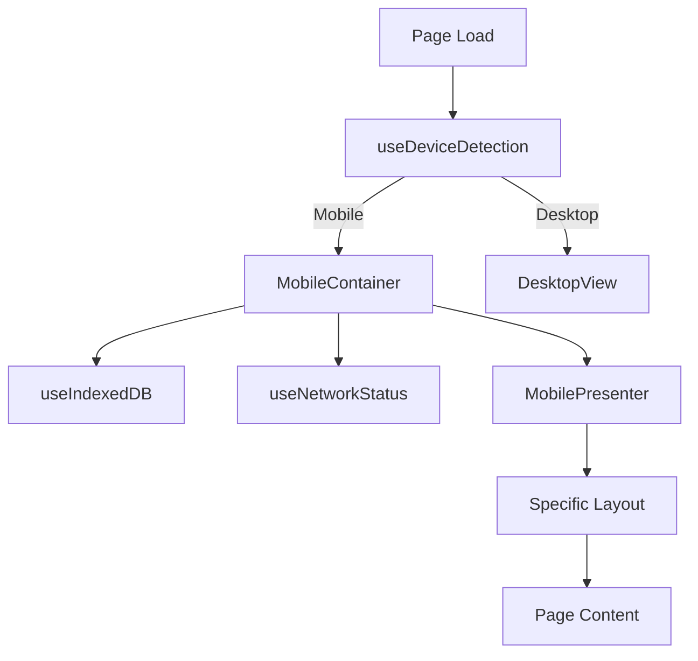
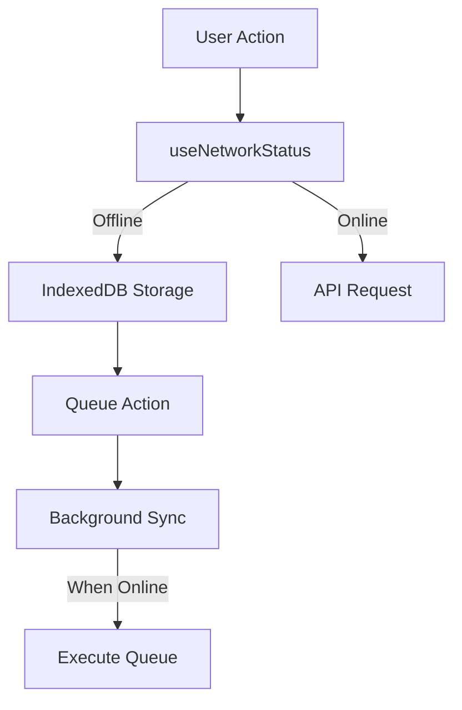
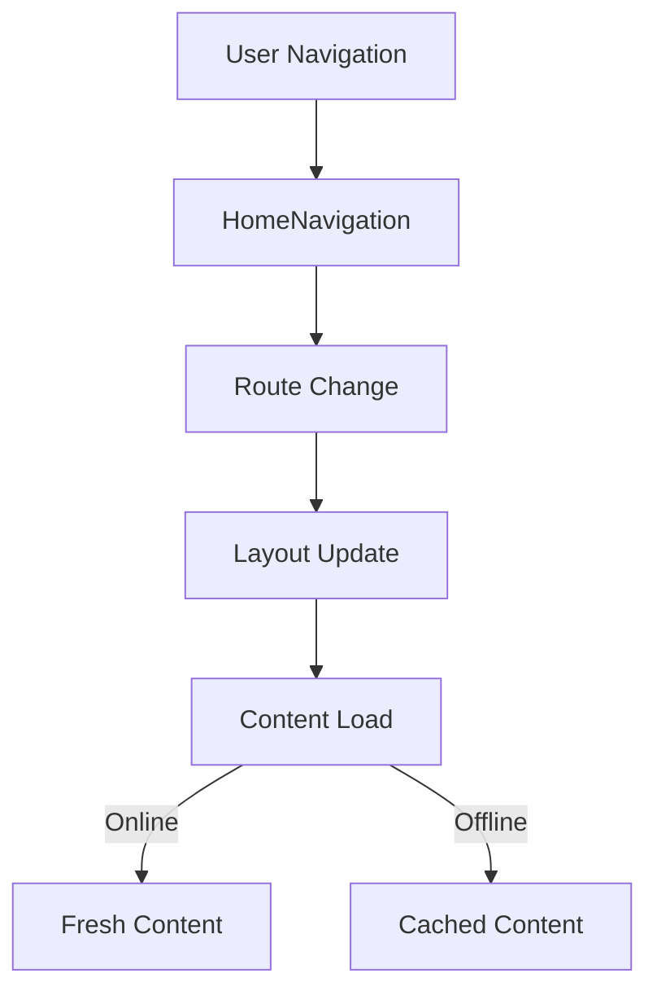

# Mobile Implementation Documentation

## Overview
This document details the mobile-first implementation of the Hair Education Platform, following the Container-Presenter pattern with offline support and optimized performance.

## Directory Structure
```
src/
├── components/
│   └── mobile/
│       ├── core/
│       │   ├── MobileContainer.tsx
│       │   └── MobilePresenter.tsx
│       ├── containers/
│       │   ├── ChapterContainer.tsx
│       │   ├── ToolContainer.tsx
│       │   └── HomeContainer.tsx
│       ├── layouts/
│       │   ├── BaseMobileLayout.tsx
│       │   ├── ChapterMobileLayout.tsx
│       │   ├── ToolMobileLayout.tsx
│       │   └── HomeMobileLayout.tsx
│       ├── navigation/
│       │   ├── HomeNavigation.tsx
│       │   └── MobileHeader.tsx
│       ├── gestures/
│       │   └── useGestures.ts
│       └── templates/    # Added templates directory
│           ├── MobileChapterPage.tsx
│           ├── MobileToolPage.tsx
│           └── MobileOverviewPage.tsx
├── hooks/
│   ├── useDeviceDetection.ts
│   ├── useIndexedDB.ts
│   ├── useDevice.ts
│   ├── useNetworkStatus.ts
│   ├── useOfflineSync.ts
│   └── useProgress.ts
└── styles/
    └── mobile.css
```

## Core Components

### 1. MobileContainer.tsx
**Purpose**: Core container component that handles data and business logic.
**Key Features**:
- Manages IndexedDB data storage
- Handles offline synchronization
- Provides data context to presenters

```typescript
interface MobileContainerProps {
  children: ReactNode;
  pageId: string;
}
```

### 2. MobilePresenter.tsx
**Purpose**: Core presenter component that handles UI rendering.
**Key Features**:
- Gesture handling
- Offline state display
- Layout management

```typescript
interface MobilePresenterProps {
  containerState: any;
  layout: ComponentType;
  children: ReactNode;
}
```

## Layout System

### 1. Base Mobile Layout
```typescript
interface BaseMobileLayoutProps {
  children: ReactNode;
  title?: string;
  showBackButton?: boolean;
  contentClassName?: string;
}

const BaseMobileLayout: FC<BaseMobileLayoutProps> = ({
  children,
  title,
  showBackButton = true,
  contentClassName = ''
}) => {
  return (
    <div className="mobile-layout">
      <MobileHeader 
        title={title}
        showBackButton={showBackButton}
      />
      <main className={`mobile-content ${contentClassName}`}>
        {children}
      </main>
    </div>
  );
};
```

### 2. Home Layout
```typescript
interface HomeMobileLayoutProps {
  children: ReactNode;
}

const HomeMobileLayout: FC<HomeMobileLayoutProps> = ({
  children
}) => {
  return (
    <BaseMobileLayout 
      showBackButton={false}
      contentClassName="pb-32" // Space for navigation
    >
      {children}
      <MobileHomeNavigation />
    </BaseMobileLayout>
  );
};
```

### 3. Tool Layout
```typescript
interface ToolMobileLayoutProps {
  children: ReactNode;
  title: string;
  fullScreen?: boolean;
}

const ToolMobileLayout: FC<ToolMobileLayoutProps> = ({
  children,
  title,
  fullScreen = false
}) => {
  return (
    <BaseMobileLayout 
      title={title}
      contentClassName={fullScreen ? 'p-0' : ''}
    >
      {children}
    </BaseMobileLayout>
  );
};
```

### 4. Layout Usage
```typescript
// Example page implementation
function ColorConsultationPage() {
  const isMobile = useDeviceDetection();
  
  if (isMobile) {
    return (
      <MobileErrorBoundary>
        <ToolContainer
          toolId="color-consultation"
          title="Color Consultation"
        >
          {(containerState) => (
            <ToolMobileLayout
              title="Color Consultation"
              fullScreen={false}
            >
              <ColorConsultationForm
                onSubmit={containerState.saveData}
                initialData={containerState.data}
              />
            </ToolMobileLayout>
          )}
        </ToolContainer>
      </MobileErrorBoundary>
    );
  }

  return <DesktopVersion />;
}
```

### 5. Layout CSS
```css
.mobile-layout {
  min-height: 100vh;
  display: flex;
  flex-direction: column;
}

.mobile-content {
  flex: 1;
  padding: var(--content-padding);
  padding-top: calc(var(--header-height) + var(--content-padding));
  padding-bottom: calc(var(--bottom-nav-height) + var(--content-padding));
}

.mobile-content.full-screen {
  padding: 0;
}

/* Safe area insets */
@supports (padding: env(safe-area-inset-top)) {
  .mobile-content {
    padding-top: calc(
      env(safe-area-inset-top) + 
      var(--header-height) + 
      var(--content-padding)
    );
    padding-bottom: calc(
      env(safe-area-inset-bottom) + 
      var(--bottom-nav-height) + 
      var(--content-padding)
    );
    padding-left: calc(
      env(safe-area-inset-left) + 
      var(--content-padding)
    );
    padding-right: calc(
      env(safe-area-inset-right) + 
      var(--content-padding)
    );
  }
}
```

## Layout Components

### 1. BaseMobileLayout.tsx
**Purpose**: Foundation layout component for all mobile pages.
**Features**:
- Header management
- Safe area handling
- Content padding
- Back button logic

```typescript
interface BaseMobileLayoutProps {
  children: ReactNode;
  title?: string;
  showHeader?: boolean;
  showBackButton?: boolean;
}
```

### 2. ChapterMobileLayout.tsx
**Purpose**: Specialized layout for chapter pages.
**Features**:
- Progress bar
- Completion button
- Chapter navigation
- Extra padding for progress UI

### 3. ToolMobileLayout.tsx
**Purpose**: Specialized layout for interactive tools.
**Features**:
- Full-screen mode
- Tool-specific controls
- Flexible padding options

### 4. HomeMobileLayout.tsx
**Purpose**: Specialized layout for home and overview pages.
**Features**:
- Bottom navigation
- No back button
- Course progress overview

## Template System

### Purpose
The template system provides reusable page templates for different types of content, ensuring consistency while allowing customization.

### Directory Structure
```
src/
└── components/
    └── mobile/
        └── templates/
            ├── MobileChapterPage.tsx
            ├── MobileToolPage.tsx
            └── MobileOverviewPage.tsx
```

### Usage
```typescript
// Example of using a template
import MobileChapterTemplate from '@/components/mobile/templates/MobileChapterPage';

export default function BeginnerChapter1() {
  return (
    <MobileChapterTemplate
      title="Chapter 1"
      content={<ChapterContent />}
      progress={30}
    />
  );
}
```

### Available Templates

#### 1. MobileChapterPage
- For chapter content
- Progress tracking
- Navigation controls
- Content sections

#### 2. MobileToolPage
- For interactive tools
- Full-screen mode
- Tool-specific controls
- Result saving

#### 3. MobileOverviewPage
- For course overviews
- Progress summaries
- Quick navigation
- Section highlights

## Navigation Components

### 1. HomeNavigation.tsx
**Purpose**: Bottom navigation for mobile interface.
**Features**:
- Tab-based navigation
- Persistent across stack
- Badge notifications
- Active state feedback

```typescript
interface HomeNavigationProps {
  activeTab?: string;
  onTabChange?: (tab: string) => void;
}
```

### 2. MobileHeader.tsx
**Purpose**: Consistent header across mobile pages.
**Features**:
- Back button handling
- Title display
- Action buttons
- Safe area handling

```typescript
interface MobileHeaderProps {
  title?: string;
  showBackButton?: boolean;
  onBack?: () => void;
}
```

## Specialized Containers

### 1. ChapterContainer.tsx
**Purpose**: Container for chapter pages.
**Features**:
- Progress tracking
- Chapter completion handling
- Offline content management

```typescript
interface ChapterContainerProps {
  chapterId: string;
  title: string;
  children: ReactNode;
}
```

### 2. ToolContainer.tsx
**Purpose**: Container for interactive tools.
**Features**:
- Tool state management
- Offline tool functionality
- Full-screen handling

```typescript
interface ToolContainerProps {
  toolId: string;
  title: string;
  children: ReactNode;
  fullScreen?: boolean;
}
```

### 3. HomeContainer.tsx
**Purpose**: Container for home pages.
**Features**:
- Course progress aggregation
- Navigation state
- User preferences

## Core Hooks

### 1. useOfflineSync
**Purpose**: Manages offline synchronization of data
**Features**:
- Tracks online/offline status
- Manages sync queue
- Handles retry logic
- Provides sync status

```typescript
interface SyncStatus {
  isSyncing: boolean;
  lastSync: Date | null;
  pendingActions: number;
}

const useOfflineSync = () => {
  const { isOnline, syncStatus } = useOfflineSync();
  // Implementation
};
```

### 2. useProgress
**Purpose**: Tracks and manages user progress
**Features**:
- Progress persistence
- Cross-device sync
- Offline progress tracking
- Progress recovery

```typescript
interface Progress {
  current: number;
  total: number;
  completed: boolean;
}

const useProgress = (chapterId: string) => {
  const { progress, updateProgress } = useProgress(chapterId);
  // Implementation
};
```

## Hooks

### 1. useDeviceDetection.ts
**Purpose**: Detect device type and characteristics.
**Features**:
- Mobile detection
- Screen size awareness
- Orientation changes

```typescript
const useDeviceDetection = () => {
  const [isMobile, setIsMobile] = useState(false);
  // Implementation details
};
```

### 2. useIndexedDB.ts
**Purpose**: Handle offline data storage.
**Features**:
- Data persistence
- Offline sync
- Storage optimization

```typescript
const useIndexedDB = (pageId: string) => {
  const [data, setData] = useState(null);
  // Implementation details
};
```

### 3. useDevice.ts
**Purpose**: Extended device capabilities detection.
**Features**:
- Screen size detection
- OS detection
- Browser capabilities
- Touch support detection

```typescript
interface DeviceInfo {
  isMobile: boolean;
  isTablet: boolean;
  os: string;
  browser: string;
  hasTouch: boolean;
}
```

### 4. useNetworkStatus.ts
**Purpose**: Network connectivity management.
**Features**:
- Online/offline detection
- Connection quality monitoring
- Reconnection handling
- Background sync support

```typescript
interface NetworkStatus {
  isOnline: boolean;
  connectionType?: string;
  effectiveType?: string;
}
```

## Gesture Handling

### 1. Touch Gestures
```typescript
interface TouchState {
  touchStart: number;
  touchEnd: number;
}

const useSwipeGesture = (onSwipe: (direction: 'left' | 'right') => void) => {
  const [touch, setTouch] = useState<TouchState>({
    touchStart: 0,
    touchEnd: 0
  });

  const handleTouchStart = (e: React.TouchEvent) => {
    setTouch(prev => ({
      ...prev,
      touchStart: e.targetTouches[0].clientX
    }));
  };

  const handleTouchMove = (e: React.TouchEvent) => {
    setTouch(prev => ({
      ...prev,
      touchEnd: e.targetTouches[0].clientX
    }));
  };

  const handleTouchEnd = () => {
    const swipeDistance = touch.touchStart - touch.touchEnd;
    if (Math.abs(swipeDistance) > 100) {
      onSwipe(swipeDistance > 0 ? 'left' : 'right');
    }
    setTouch({ touchStart: 0, touchEnd: 0 });
  };

  return {
    handleTouchStart,
    handleTouchMove,
    handleTouchEnd
  };
};
```

### 2. Menu Gesture Integration
```typescript
interface MenuProps {
  isOpen: boolean;
  onClose: () => void;
}

const MobileMenu: FC<MenuProps> = ({ isOpen, onClose }) => {
  const swipeGesture = useSwipeGesture((direction) => {
    if (direction === 'left') onClose();
  });

  useEffect(() => {
    if (isOpen) {
      document.body.style.overflow = 'hidden';
    } else {
      document.body.style.overflow = 'unset';
    }
    return () => {
      document.body.style.overflow = 'unset';
    };
  }, [isOpen]);

  return (
    <div
      {...swipeGesture}
      className={`mobile-menu ${isOpen ? 'open' : ''}`}
    >
      {/* Menu content */}
    </div>
  );
};
```

### 3. Scroll Lock Management
```typescript
const useScrollLock = (isLocked: boolean) => {
  useEffect(() => {
    if (isLocked) {
      const scrollY = window.scrollY;
      document.body.style.position = 'fixed';
      document.body.style.top = `-${scrollY}px`;
    } else {
      const scrollY = document.body.style.top;
      document.body.style.position = '';
      document.body.style.top = '';
      window.scrollTo(0, parseInt(scrollY || '0') * -1);
    }
  }, [isLocked]);
};
```

### 4. Pull-to-Refresh
```typescript
const usePullToRefresh = (onRefresh: () => Promise<void>) => {
  const [refreshing, setRefreshing] = useState(false);
  const pullStartY = useRef(0);
  const pullMoveY = useRef(0);

  const handleTouchStart = (e: TouchEvent) => {
    const { screenY } = e.touches[0];
    pullStartY.current = screenY;
  };

  const handleTouchMove = (e: TouchEvent) => {
    const { screenY } = e.touches[0];
    pullMoveY.current = screenY;
  };

  const handleTouchEnd = async () => {
    if (pullStartY.current < pullMoveY.current - 100) {
      setRefreshing(true);
      await onRefresh();
      setRefreshing(false);
    }
  };

  return { refreshing, handleTouchStart, handleTouchMove, handleTouchEnd };
};
```

## Mobile Navigation Patterns

### 1. Stack Navigation
- Push/pop pages
- Back button handling
- History management
- Transition animations

### 2. Tab Navigation
- Bottom tabs for main sections
- Persistent across stack
- Badge notifications
- Active state feedback

### 3. Gesture Navigation
- Swipe back
- Swipe between tabs
- Pull to refresh
- Edge swipe menus

## Network and Offline Handling

### 1. Online Mode
- Real-time sync
- Full feature access
- High-quality media
- Live updates

### 2. Offline Mode
- Cached content access
- Queued actions
- Reduced quality media
- Sync status indicator

### 3. Background Sync
- Priority queue
- Retry mechanism
- Conflict resolution
- Progress tracking

## CSS Implementation

### 1. Animations
```css
/* Mobile-specific animations */
@keyframes slideIn {
  from {
    transform: translateX(-100%);
    opacity: 0;
  }
  to {
    transform: translateX(0);
    opacity: 1;
  }
}

@keyframes fadeIn {
  from { opacity: 0; }
  to { opacity: 1; }
}
```

### 2. Touch Feedback
```css
.touch-feedback {
  position: relative;
  overflow: hidden;
}

.touch-feedback::after {
  content: '';
  position: absolute;
  background: rgba(255, 255, 255, 0.3);
  border-radius: 50%;
  transform: scale(0);
  transition: transform 0.3s;
}
```

### 3. Safe Areas
```css
.safe-area-inset {
  padding-top: env(safe-area-inset-top);
  padding-bottom: env(safe-area-inset-bottom);
  padding-left: env(safe-area-inset-left);
  padding-right: env(safe-area-inset-right);
}
```

### 4. Responsive Units
```css
:root {
  --vh: 1vh;  /* Dynamic viewport height */
  --header-height: 56px;
  --bottom-nav-height: 64px;
  --content-padding: 16px;
}
```

## Styles

### mobile.css
**Purpose**: Mobile-specific styles and utilities.
**Features**:
- Touch-friendly sizes
- Safe area handling
- Mobile-specific animations
- Responsive utilities

```css
.mobile-touch-target {
  @apply min-h-[48px] min-w-[48px];
}

.mobile-safe-bottom {
  @apply pb-[env(safe-area-inset-bottom)];
}
```

## Implementation Requirements

### 1. Mobile-First Development
- Start with mobile layout
- Consider offline scenarios
- Optimize for touch
- Handle different screen sizes

### 2. Performance Requirements
- First contentful paint < 1.5s
- Time to interactive < 3.5s
- Offline capability
- Smooth animations (60fps)

### 3. Network Requirements
- Handle slow connections
- Graceful offline degradation
- Background sync
- Bandwidth optimization

### 4. Storage Requirements
- IndexedDB for large data
- LocalStorage for preferences
- Clear storage policies
- Quota management

## Security Considerations

### 1. Data Security
- Encrypted storage
- Secure sync
- Data validation
- Access control

### 2. User Privacy
- Data minimization
- Clear data policies
- User consent
- Data cleanup

## Component Interaction Scenarios

### 1. Page Load Flow


### 2. Offline Mode Flow


### 3. Navigation Flow


## State Management

### 1. Global Mobile State
```typescript
interface MobileState {
  isOnline: boolean;
  deviceInfo: DeviceInfo;
  networkStatus: NetworkStatus;
  syncQueue: Array<QueuedAction>;
}
```

### 2. Page-Specific State
```typescript
interface PageState {
  pageId: string;
  offlineData: any;
  lastSync: Date;
  pendingChanges: boolean;
}
```

## Error Handling and Recovery

### 1. Network Errors
- Automatic retry with exponential backoff
- Fallback to cached content
- User notification
- Sync status tracking

### 2. Storage Errors
- Quota management
- Data cleanup strategies
- Priority-based eviction
- Error recovery flows

### 3. UI Error Boundaries
- Graceful degradation
- Error reporting
- Recovery options
- User feedback

## Performance Optimization

### 1. Code Splitting
```typescript
// Dynamic imports for heavy components
const ColorWheel = dynamic(() => import('@/components/ColorWheel'), {
  loading: () => <LoadingSpinner />,
  ssr: false
});
```

### 2. Image Optimization
- Responsive images
- Lazy loading
- Quality optimization
- Format selection

### 3. State Management
- Local state for UI
- IndexedDB for data
- Memory management
- Cache strategies

## Testing Strategy

### 1. Unit Testing Setup
```typescript
// jest.config.js
module.exports = {
  setupFilesAfterEnv: ['<rootDir>/jest.setup.ts'],
  testEnvironment: 'jsdom',
  moduleNameMapper: {
    '^@/components/(.*)$': '<rootDir>/src/components/$1',
    '^@/hooks/(.*)$': '<rootDir>/src/hooks/$1'
  }
};

// Example Component Test
import { render, screen, fireEvent } from '@testing-library/react';
import MobileCard from '@/components/mobile/MobileCard';

describe('MobileCard', () => {
  it('renders with title and content', () => {
    render(
      <MobileCard
        title="Test Card"
        content={<div>Test Content</div>}
      />
    );
    
    expect(screen.getByText('Test Card')).toBeInTheDocument();
    expect(screen.getByText('Test Content')).toBeInTheDocument();
  });

  it('handles touch events', () => {
    const onPress = jest.fn();
    render(
      <MobileCard
        title="Test Card"
        content={<div>Test Content</div>}
        onPress={onPress}
      />
    );
    
    fireEvent.click(screen.getByText('Test Card'));
    expect(onPress).toHaveBeenCalled();
  });
});
```

### 2. Integration Testing
```typescript
// cypress/integration/mobile.spec.ts
describe('Mobile Experience', () => {
  beforeEach(() => {
    cy.viewport('iphone-x');
    cy.visit('/');
  });

  it('handles offline mode', () => {
    cy.intercept('GET', '/api/**', { forceNetworkError: true });
    
    // Should show offline indicator
    cy.get('[data-testid="offline-indicator"]')
      .should('be.visible');
    
    // Should use cached data
    cy.get('[data-testid="content"]')
      .should('exist');
  });

  it('syncs data when back online', () => {
    // Go offline
    cy.intercept('GET', '/api/**', { forceNetworkError: true });
    
    // Make changes
    cy.get('[data-testid="edit-button"]').click();
    cy.get('[data-testid="input"]').type('Offline Change');
    cy.get('[data-testid="save"]').click();
    
    // Go online
    cy.intercept('GET', '/api/**').as('sync');
    cy.get('[data-testid="online-indicator"]')
      .should('be.visible');
    
    // Should sync changes
    cy.wait('@sync');
  });
});
```

### 3. Performance Testing
```typescript
// lighthouse.config.js
module.exports = {
  ci: {
    collect: {
      startServerCommand: 'npm run start',
      url: ['http://localhost:3000'],
      numberOfRuns: 3,
    },
    assert: {
      assertions: {
        'first-contentful-paint': ['warn', { maxNumericValue: 2000 }],
        'interactive': ['error', { maxNumericValue: 3500 }],
        'offline-start-url': 'error',
        'service-worker': 'error',
        'works-offline': 'error'
      }
    },
    upload: {
      target: 'temporary-public-storage',
    },
  },
};

// Example Performance Test
describe('Performance', () => {
  it('loads and becomes interactive quickly', async () => {
    const metrics = await page.metrics();
    expect(metrics.FirstContentfulPaint).toBeLessThan(2000);
    expect(metrics.DomInteractive).toBeLessThan(3500);
  });

  it('handles memory efficiently', async () => {
    const start = await page.metrics();
    
    // Perform intensive operations
    await page.click('#load-more');
    await page.waitForTimeout(1000);
    
    const end = await page.metrics();
    expect(end.JSHeapUsedSize - start.JSHeapUsedSize)
      .toBeLessThan(5 * 1024 * 1024); // 5MB limit
  });
});
```

### 4. Device Testing Matrix
```typescript
const devices = [
  { name: 'iPhone SE', width: 375, height: 667 },
  { name: 'iPhone X', width: 375, height: 812 },
  { name: 'Pixel 2', width: 411, height: 731 },
  { name: 'iPad', width: 768, height: 1024 }
];

describe('Device Compatibility', () => {
  devices.forEach(device => {
    describe(`${device.name} (${device.width}x${device.height})`, () => {
      beforeEach(() => {
        cy.viewport(device.width, device.height);
        cy.visit('/');
      });

      it('renders layout correctly', () => {
        cy.get('[data-testid="layout"]')
          .should('be.visible')
          .and('have.css', 'width', `${device.width}px`);
      });

      it('handles touch interactions', () => {
        cy.get('[data-testid="button"]')
          .trigger('touchstart')
          .trigger('touchend');
      });
    });
  });
});
```

## Usage Examples

### Chapter Page Implementation
```typescript
export function ChapterPage() {
  const isMobile = useDeviceDetection();
  
  if (isMobile) {
    return (
      <ChapterContainer
        chapterId="beginner-1"
        title="Introduction"
      >
        {/* Content */}
      </ChapterContainer>
    );
  }
}
```

### Tool Page Implementation
```typescript
export function ToolPage() {
  const isMobile = useDeviceDetection();
  
  if (isMobile) {
    return (
      <ToolContainer
        toolId="color-wheel"
        title="Color Wheel"
        fullScreen={true}
      >
        {/* Tool Content */}
      </ToolContainer>
    );
  }
}
```

## Best Practices

1. **Mobile-First Development**
   - Always start with mobile implementation
   - Use touch-friendly sizes (minimum 48x48px)
   - Consider offline scenarios

2. **Performance**
   - Use dynamic imports for heavy components
   - Implement proper code splitting
   - Optimize images and media

3. **Offline Support**
   - Always handle offline scenarios
   - Implement proper data syncing
   - Provide offline feedback to users

4. **Accessibility**
   - Use proper touch targets
   - Implement proper contrast
   - Support screen readers

5. **Testing**
   - Test on various devices
   - Test offline functionality
   - Test different network conditions

## Implementation Flow

1. Start with device detection
2. Choose appropriate container
3. Implement offline support
4. Add mobile-specific features
5. Test and optimize

## Troubleshooting

Common issues and solutions:
1. Layout issues: Check safe areas and viewport settings
2. Offline sync: Verify IndexedDB implementation
3. Performance: Check dynamic imports and code splitting
4. Touch events: Verify touch target sizes

## Future Improvements

1. Add more specialized layouts
2. Enhance offline capabilities
3. Implement more touch gestures
4. Add progressive web app features
5. Improve performance monitoring

## Automated Implementation Helper

```typescript
// scripts/generate-mobile-checklist.ts
import { promises as fs } from 'fs';
import path from 'path';

interface ChecklistItem {
  category: string;
  item: string;
  required: boolean;
  autoCheck?: () => boolean;
}

const CHECKLIST: ChecklistItem[] = [
  // Setup
  { 
    category: 'Setup',
    item: 'Container Type',
    required: true,
    autoCheck: () => {
      return sourceCode.includes('MobileContainer') ||
             sourceCode.includes('ToolContainer') ||
             sourceCode.includes('ChapterContainer');
    }
  },
  { 
    category: 'Setup',
    item: 'Error Boundary',
    required: true,
    autoCheck: () => sourceCode.includes('MobileErrorBoundary')
  },
  
  // Data
  {
    category: 'Data',
    item: 'IndexedDB Storage',
    required: true,
    autoCheck: () => sourceCode.includes('useIndexedDB')
  },
  {
    category: 'Data',
    item: 'Sync Queue',
    required: true,
    autoCheck: () => sourceCode.includes('useSyncQueue')
  },

  // UI
  {
    category: 'UI',
    item: 'Safe Areas',
    required: true,
    autoCheck: () => cssCode.includes('env(safe-area-inset')
  },
  {
    category: 'UI',
    item: 'Loading States',
    required: true,
    autoCheck: () => sourceCode.includes('isLoading') || sourceCode.includes('isFetching')
  },

  // Tests
  {
    category: 'Tests',
    item: 'Unit Tests',
    required: true,
    autoCheck: () => {
      const testFile = `${componentPath}.test.tsx`;
      return fs.existsSync(testFile);
    }
  }
];

async function generateChecklist(componentPath: string) {
  const sourceCode = await fs.readFile(componentPath, 'utf-8');
  const cssPath = path.join(path.dirname(componentPath), 'styles.css');
  const cssCode = await fs.readFile(cssPath, 'utf-8');

  const results = CHECKLIST.map(item => {
    const passed = item.autoCheck?.() ?? null;
    return {
      ...item,
      status: passed === null ? 'Manual Check Required' : passed ? 'Passed' : 'Failed'
    };
  });

  // Generate markdown report
  const report = ['# Mobile Implementation Checklist\n'];
  let currentCategory = '';

  results.forEach(({ category, item, required, status }) => {
    if (category !== currentCategory) {
      report.push(`\n## ${category}`);
      currentCategory = category;
    }
    const requiredMark = required ? '(Required)' : '(Optional)';
    const emoji = status === 'Passed' ? '✅' : status === 'Failed' ? '❌' : '⚠️';
    report.push(`- ${emoji} ${item} ${requiredMark} - ${status}`);
  });

  await fs.writeFile('mobile-checklist.md', report.join('\n'));
  
  // Show required items that failed
  const failures = results.filter(r => r.required && r.status === 'Failed');
  if (failures.length > 0) {
    console.error('Required checks failed:');
    failures.forEach(f => console.error(`- ${f.item}`));
    process.exit(1);
  }
}

// Usage in package.json scripts:
// "check-mobile": "ts-node scripts/generate-mobile-checklist.ts"
```

Now you can run:
```bash
npm run check-mobile src/pages/YourNewPage.tsx
```

This will:
1. Automatically check for required patterns and components
2. Generate a checklist report
3. Fail the build if required items are missing
4. Create a TODO list of manual checks needed

You can also integrate this into your CI/CD pipeline to ensure mobile requirements are met before deployment.

## Device Detection and Responsive Design

### 1. Device Detection Hook
```typescript
import { useState, useEffect } from 'react';

export const useDeviceDetection = () => {
  const [isMobile, setIsMobile] = useState(false);

  useEffect(() => {
    const checkDevice = () => {
      setIsMobile(window.innerWidth <= 768);
    };
    
    checkDevice();
    window.addEventListener('resize', checkDevice);
    return () => window.removeEventListener('resize', checkDevice);
  }, []);

  return isMobile;
};
```

### 2. Breakpoint System
```typescript
const breakpoints = {
  mobile: 320,
  tablet: 768,
  desktop: 1024,
  wide: 1280
} as const;

type Breakpoint = keyof typeof breakpoints;

const useBreakpoint = () => {
  const [breakpoint, setBreakpoint] = useState<Breakpoint>('mobile');

  useEffect(() => {
    const handleResize = () => {
      const width = window.innerWidth;
      if (width >= breakpoints.wide) setBreakpoint('wide');
      else if (width >= breakpoints.desktop) setBreakpoint('desktop');
      else if (width >= breakpoints.tablet) setBreakpoint('tablet');
      else setBreakpoint('mobile');
    };

    handleResize();
    window.addEventListener('resize', handleResize);
    return () => window.removeEventListener('resize', handleResize);
  }, []);

  return breakpoint;
};
```

### 3. Responsive Layout System
```typescript
interface ResponsiveProps {
  mobile: ReactNode;
  tablet?: ReactNode;
  desktop?: ReactNode;
}

const ResponsiveLayout: FC<ResponsiveProps> = ({
  mobile,
  tablet,
  desktop
}) => {
  const breakpoint = useBreakpoint();
  
  if (breakpoint === 'desktop' && desktop) return desktop;
  if (breakpoint === 'tablet' && tablet) return tablet;
  return mobile;
};
```

### 4. Media Query Hooks
```typescript
const useMediaQuery = (query: string) => {
  const [matches, setMatches] = useState(false);

  useEffect(() => {
    const media = window.matchMedia(query);
    const updateMatch = () => setMatches(media.matches);
    
    updateMatch();
    media.addEventListener('change', updateMatch);
    return () => media.removeEventListener('change', updateMatch);
  }, [query]);

  return matches;
};

// Usage examples
const isPortrait = useMediaQuery('(orientation: portrait)');
const prefersReducedMotion = useMediaQuery('(prefers-reduced-motion)');
const supportsHover = useMediaQuery('(hover: hover)');
```

## Next.js Integration

### 1. Middleware Implementation
```typescript
// middleware.ts
import { NextResponse } from 'next/server';
import type { NextRequest } from 'next/server';

export function middleware(request: NextRequest) {
  // Device detection without impacting SEO
  const userAgent = request.headers.get('user-agent');
  const isMobile = /mobile|android|ios/i.test(userAgent || '');
  
  // Add device type to headers
  const response = NextResponse.next();
  response.headers.set('x-device-type', isMobile ? 'mobile' : 'desktop');
  
  return response;
}
```

### 2. Video Content Handling
```typescript
interface VideoQuality {
  resolution: string;
  bitrate: number;
  size: number;
}

const videoQualities: Record<string, VideoQuality> = {
  low: { resolution: '480p', bitrate: 800, size: 0.5 },
  medium: { resolution: '720p', bitrate: 1500, size: 1 },
  high: { resolution: '1080p', bitrate: 3000, size: 2 }
};

const useAdaptiveStreaming = (videoUrl: string) => {
  const { networkStatus } = useNetworkStatus();
  const quality = determineQuality(networkStatus);
  return getVideoStream(videoUrl, quality);
};
```

## User Tiers and Quotas

### 1. Storage Quotas
```typescript
interface StorageQuota {
  maxSize: number;  // in MB
  maxVideos: number;
  maxImages: number;
  offlineAccess: boolean;
}

const quotas: Record<'free' | 'premium', StorageQuota> = {
  free: {
    maxSize: 100,
    maxVideos: 5,
    maxImages: 20,
    offlineAccess: false
  },
  premium: {
    maxSize: 1000,
    maxVideos: 50,
    maxImages: 200,
    offlineAccess: true
  }
};
```

### 2. Feature Access
```typescript
interface FeatureAccess {
  colorWheel: boolean;
  clientHistory: boolean;
  appointments: boolean;
  analytics: boolean;
}

const featureAccess: Record<'free' | 'premium', FeatureAccess> = {
  free: {
    colorWheel: true,
    clientHistory: false,
    appointments: false,
    analytics: false
  },
  premium: {
    colorWheel: true,
    clientHistory: true,
    appointments: true,
    analytics: true
  }
};
```

## Salon Features

### 1. Multi-User Management
```typescript
interface SalonUser {
  id: string;
  role: 'owner' | 'stylist' | 'assistant';
  permissions: string[];
  clients: string[];
}

const useSalonManagement = (salonId: string) => {
  const { users, addUser, removeUser } = useSalonUsers(salonId);
  const { permissions, updatePermissions } = usePermissions(salonId);
  return { users, permissions, addUser, removeUser, updatePermissions };
};
```

### 2. Client Management
```typescript
interface ClientProfile {
  id: string;
  history: ColorHistory[];
  appointments: Appointment[];
  preferences: ClientPreferences;
  stylist: string;
}

const useClientManagement = (clientId: string) => {
  const { profile, updateProfile } = useClientProfile(clientId);
  const { history, addColorService } = useColorHistory(clientId);
  return { profile, history, updateProfile, addColorService };
};
```

## Authentication Integration

### 1. Supabase Auth
```typescript
import { supabase } from '@/lib/supabase';

// Sign Out Implementation
const handleSignOut = async () => {
  await supabase.auth.signOut();
  window.location.href = '/auth/signin';
};

// Auth State Management
const useAuth = () => {
  const [session, setSession] = useState<Session | null>(null);
  
  useEffect(() => {
    supabase.auth.getSession().then(({ data: { session } }) => {
      setSession(session);
    });

    const {
      data: { subscription },
    } = supabase.auth.onAuthStateChange((_event, session) => {
      setSession(session);
    });

    return () => subscription.unsubscribe();
  }, []);

  return session;
};
```

### 2. Protected Routes
```typescript
// middleware.ts
import { createMiddlewareClient } from '@supabase/auth-helpers-nextjs';

export async function middleware(req: NextRequest) {
  const res = NextResponse.next();
  const supabase = createMiddlewareClient({ req, res });
  const {
    data: { session },
  } = await supabase.auth.getSession();

  if (!session && !req.nextUrl.pathname.startsWith('/auth')) {
    return NextResponse.redirect(new URL('/auth/signin', req.url));
  }

  return res;
}
```

### 3. Auth Components
```typescript
interface AuthProps {
  children: ReactNode;
  requiredRole?: string;
}

const AuthGuard: FC<AuthProps> = ({ children, requiredRole }) => {
  const session = useAuth();
  const userRole = session?.user?.user_metadata?.role;

  if (!session) {
    return <Navigate to="/auth/signin" />;
  }

  if (requiredRole && userRole !== requiredRole) {
    return <Navigate to="/unauthorized" />;
  }

  return <>{children}</>;
};
```

## Color System Integration

### 1. Database Schema
```sql
-- Color system enums
CREATE TYPE hair_color_type AS ENUM (
  'permanent',
  'semi-permanent',
  'demi-permanent',
  'temporary'
);

CREATE TYPE developer_strength AS ENUM (
  'low',
  'medium',
  'high',
  'ultra'
);

-- Color levels table
CREATE TABLE color_levels (
  id UUID DEFAULT uuid_generate_v4() PRIMARY KEY,
  level_number INTEGER NOT NULL,
  description TEXT NOT NULL,
  underlying_pigment TEXT NOT NULL,
  lifting_capability TEXT,
  general_notes TEXT
);

-- Color guidelines table
CREATE TABLE color_guidelines (
  id UUID DEFAULT uuid_generate_v4() PRIMARY KEY,
  starting_level INTEGER NOT NULL,
  target_level INTEGER NOT NULL,
  developer_strength developer_strength NOT NULL,
  processing_time_range JSONB NOT NULL,
  precautions TEXT[],
  recommendations TEXT[]
);
```

### 2. Color System Hooks
```typescript
interface ColorLevel {
  id: string;
  levelNumber: number;
  description: string;
  underlyingPigment: string;
  liftingCapability?: string;
  generalNotes?: string;
}

interface ColorGuideline {
  id: string;
  startingLevel: number;
  targetLevel: number;
  developerStrength: 'low' | 'medium' | 'high' | 'ultra';
  processingTimeRange: {
    min: number;
    max: number;
  };
  precautions: string[];
  recommendations: string[];
}

const useColorSystem = () => {
  const [levels, setLevels] = useState<ColorLevel[]>([]);
  const [guidelines, setGuidelines] = useState<ColorGuideline[]>([]);

  const fetchColorData = async () => {
    const { data: levels } = await supabase
      .from('color_levels')
      .select('*')
      .order('level_number');

    const { data: guidelines } = await supabase
      .from('color_guidelines')
      .select('*');

    setLevels(levels);
    setGuidelines(guidelines);
  };

  return { levels, guidelines, fetchColorData };
};
```

### 3. Color Calculator Component
```typescript
interface ColorCalculatorProps {
  startingLevel: number;
  targetLevel: number;
  colorType: hair_color_type;
}

const ColorCalculator: FC<ColorCalculatorProps> = ({
  startingLevel,
  targetLevel,
  colorType
}) => {
  const { levels, guidelines } = useColorSystem();
  
  const calculateFormula = () => {
    const guideline = guidelines.find(
      g => g.startingLevel === startingLevel && 
           g.targetLevel === targetLevel
    );

    return {
      developer: guideline?.developerStrength,
      processingTime: guideline?.processingTimeRange,
      precautions: guideline?.precautions
    };
  };

  return (
    <div className="color-calculator">
      {/* Calculator UI */}
    </div>
  );
};
```

### 4. Offline Color System
```typescript
interface OfflineColorSystem {
  levels: ColorLevel[];
  guidelines: ColorGuideline[];
  lastSync: Date;
}

const useOfflineColorSystem = () => {
  const { data, saveData } = useIndexedDB<OfflineColorSystem>('colorSystem');
  
  const syncColorSystem = async () => {
    const { levels, guidelines } = await fetchColorData();
    await saveData({
      levels,
      guidelines,
      lastSync: new Date()
    });
  };

  return {
    colorSystem: data,
    syncColorSystem
  };
};
```

## Mobile UI Components

### 1. Touch Feedback System
```css
.touch-feedback {
  position: relative;
  overflow: hidden;
  -webkit-tap-highlight-color: transparent;
  transition: background-color 0.2s;
}

.touch-feedback::after {
  content: '';
  display: block;
  position: absolute;
  width: 100%;
  height: 100%;
  top: 0;
  left: 0;
  pointer-events: none;
  background-image: radial-gradient(
    circle,
    rgba(255, 255, 255, 0.3) 10%,
    transparent 10.01%
  );
  background-repeat: no-repeat;
  background-position: 50%;
  transform: scale(10, 10);
  opacity: 0;
  transition: transform 0.5s, opacity 1s;
}

.touch-feedback:active::after {
  transform: scale(0, 0);
  opacity: 0.3;
  transition: 0s;
}

.touch-feedback:active {
  background-color: rgba(255, 255, 255, 0.1);
}
```

### 2. Mobile Card Component
```typescript
interface MobileCardProps {
  title: string;
  content: ReactNode;
  onPress?: () => void;
  elevation?: 'low' | 'medium' | 'high';
}

const MobileCard: FC<MobileCardProps> = ({
  title,
  content,
  onPress,
  elevation = 'medium'
}) => {
  const elevationStyles = {
    low: 'shadow-sm',
    medium: 'shadow-md',
    high: 'shadow-lg'
  };

  return (
    <div
      className={`
        mobile-card
        ${elevationStyles[elevation]}
        touch-feedback
        rounded-lg
        bg-white
        p-4
        mb-4
      `}
      onClick={onPress}
    >
      <h3 className="text-lg font-semibold mb-2">{title}</h3>
      <div className="mobile-card-content">{content}</div>
    </div>
  );
};
```

### 3. Card List Component
```typescript
interface CardListProps {
  items: Array<{
    id: string;
    title: string;
    content: ReactNode;
    onPress?: () => void;
  }>;
  layout?: 'grid' | 'list';
}

const CardList: FC<CardListProps> = ({
  items,
  layout = 'list'
}) => {
  return (
    <div
      className={`
        card-list
        ${layout === 'grid' ? 'grid grid-cols-2 gap-4' : 'space-y-4'}
      `}
    >
      {items.map(item => (
        <MobileCard
          key={item.id}
          title={item.title}
          content={item.content}
          onPress={item.onPress}
        />
      ))}
    </div>
  );
};
```

### 4. Card Animations
```css
.mobile-card {
  transform: translateZ(0);  /* Hardware acceleration */
  transition: transform 0.2s ease-out;
}

.mobile-card:active {
  transform: scale(0.98);
}

.mobile-card-enter {
  opacity: 0;
  transform: translateY(20px);
}

.mobile-card-enter-active {
  opacity: 1;
  transform: translateY(0);
  transition: opacity 0.3s, transform 0.3s;
}

.mobile-card-exit {
  opacity: 1;
  transform: translateY(0);
}

.mobile-card-exit-active {
  opacity: 0;
  transform: translateY(-20px);
  transition: opacity 0.3s, transform 0.3s;
}

```

## Data Synchronization

### 1. Priority Queue System
```typescript
type SyncPriority = 'critical' | 'important' | 'normal' | 'low';

interface SyncItem {
  id: string;
  type: 'progress' | 'client' | 'media';
  priority: SyncPriority;
  data: any;
  timestamp: Date;
  retryCount: number;
}

const useSyncQueue = () => {
  const [queue, setQueue] = useState<SyncItem[]>([]);
  
  const addToQueue = (item: Omit<SyncItem, 'id' | 'timestamp'>) => {
    setQueue(prev => [...prev, {
      ...item,
      id: uuid(),
      timestamp: new Date()
    }]);
  };

  const processQueue = async () => {
    const sortedQueue = [...queue].sort((a, b) => {
      const priorities: Record<SyncPriority, number> = {
        critical: 3,
        important: 2,
        normal: 1,
        low: 0
      };
      return priorities[b.priority] - priorities[a.priority];
    });

    for (const item of sortedQueue) {
      try {
        await syncItem(item);
        setQueue(prev => prev.filter(i => i.id !== item.id));
      } catch (error) {
        if (item.retryCount < 3) {
          setQueue(prev => prev.map(i => 
            i.id === item.id 
              ? { ...i, retryCount: i.retryCount + 1 }
              : i
          ));
        }
      }
    }
  };

  return { queue, addToQueue, processQueue };
};
```

### 2. Conflict Resolution
```typescript
interface VersionedData {
  id: string;
  data: any;
  version: number;
  lastModified: Date;
  modifiedBy: string;
}

const resolveConflict = (local: VersionedData, remote: VersionedData) => {
  if (local.version > remote.version) {
    return local;
  }
  if (remote.version > local.version) {
    return remote;
  }
  // Same version, use timestamp
  return local.lastModified > remote.lastModified ? local : remote;
};
```

## Storage Optimization

### 1. LRU Cache Implementation
```typescript
class LRUCache<T> {
  private capacity: number;
  private cache: Map<string, T>;
  private usage: string[];

  constructor(capacity: number) {
    this.capacity = capacity;
    this.cache = new Map();
    this.usage = [];
  }

  get(key: string): T | undefined {
    if (!this.cache.has(key)) return undefined;
    
    // Move to most recently used
    this.usage = this.usage.filter(k => k !== key);
    this.usage.push(key);
    
    return this.cache.get(key);
  }

  set(key: string, value: T): void {
    if (this.cache.size >= this.capacity) {
      // Remove least recently used
      const lru = this.usage.shift();
      if (lru) this.cache.delete(lru);
    }
    
    this.cache.set(key, value);
    this.usage.push(key);
  }
}
```

### 2. Storage Quota Management
```typescript
interface StorageQuota {
  used: number;
  total: number;
  available: number;
}

const useStorageQuota = () => {
  const [quota, setQuota] = useState<StorageQuota>();

  const checkQuota = async () => {
    if ('storage' in navigator && 'estimate' in navigator.storage) {
      const estimate = await navigator.storage.estimate();
      setQuota({
        used: estimate.usage || 0,
        total: estimate.quota || 0,
        available: (estimate.quota || 0) - (estimate.usage || 0)
      });
    }
  };

  const clearOldData = async () => {
    const db = await openDB('appCache', 1);
    const tx = db.transaction('cache', 'readwrite');
    const store = tx.objectStore('cache');
    
    // Delete items older than 30 days
    const thirtyDaysAgo = Date.now() - (30 * 24 * 60 * 60 * 1000);
    const oldItems = await store.index('timestamp')
      .getAllKeys(IDBKeyRange.upperBound(thirtyDaysAgo));
    
    await Promise.all(oldItems.map(key => store.delete(key)));
  };

  return { quota, checkQuota, clearOldData };
};
```

### 3. Media Optimization
```typescript
interface MediaOptimizationOptions {
  maxWidth?: number;
  maxHeight?: number;
  quality?: number;
  format?: 'jpeg' | 'webp' | 'png';
}

const optimizeImage = async (
  file: File,
  options: MediaOptimizationOptions
) => {
  const img = new Image();
  const canvas = document.createElement('canvas');
  const ctx = canvas.getContext('2d');
  
  await new Promise(resolve => {
    img.onload = resolve;
    img.src = URL.createObjectURL(file);
  });

  const { width, height } = calculateDimensions(
    img.width,
    img.height,
    options.maxWidth,
    options.maxHeight
  );

  canvas.width = width;
  canvas.height = height;
  ctx?.drawImage(img, 0, 0, width, height);

  return new Promise<Blob>(resolve => {
    canvas.toBlob(
      blob => resolve(blob!),
      `image/${options.format || 'jpeg'}`,
      options.quality || 0.8
    );
  });
};

```

## Error Handling

### 1. Error Boundary Component
```typescript
class MobileErrorBoundary extends React.Component<
  { children: ReactNode },
  { hasError: boolean; error: Error | null }
> {
  constructor(props) {
    super(props);
    this.state = { hasError: false, error: null };
  }

  static getDerivedStateFromError(error: Error) {
    return { hasError: true, error };
  }

  componentDidCatch(error: Error, errorInfo: React.ErrorInfo) {
    // Log to error reporting service
    console.error('Error caught by boundary:', error, errorInfo);
  }

  render() {
    if (this.state.hasError) {
      return (
        <div className="mobile-error-screen">
          <h2>Something went wrong</h2>
          <p>{this.state.error?.message}</p>
          <button
            onClick={() => {
              this.setState({ hasError: false, error: null });
              window.location.reload();
            }}
          >
            Try Again
          </button>
        </div>
      );
    }

    return this.props.children;
  }
}
```

### 2. Network Error Handler
```typescript
const useNetworkErrorHandler = () => {
  const { isOnline } = useNetworkStatus();
  const [errors, setErrors] = useState<Array<{
    id: string;
    type: 'network' | 'api' | 'storage';
    message: string;
    timestamp: Date;
  }>>([]);

  const handleError = (error: Error) => {
    if (!isOnline && error.message.includes('Failed to fetch')) {
      setErrors(prev => [...prev, {
        id: uuid(),
        type: 'network',
        message: 'You are offline. Changes will sync when connection is restored.',
        timestamp: new Date()
      }]);
      return;
    }

    // Handle other types of errors
    setErrors(prev => [...prev, {
      id: uuid(),
      type: 'api',
      message: error.message,
      timestamp: new Date()
    }]);
  };

  return { errors, handleError };
};
```

### 3. Error Recovery
```typescript
const useErrorRecovery = () => {
  const { data: recoveryData } = useIndexedDB('errorRecovery');
  
  const saveRecoveryPoint = async (data: any) => {
    await saveData('errorRecovery', {
      timestamp: new Date(),
      state: data
    });
  };

  const recoverFromError = async () => {
    if (recoveryData) {
      // Restore last known good state
      return recoveryData.state;
    }
    return null;
  };

  return { saveRecoveryPoint, recoverFromError };
};
```

### 4. Usage Example
```typescript
function MobilePage() {
  return (
    <MobileErrorBoundary>
      <NetworkErrorHandler>
        <ErrorRecoveryProvider>
          {/* Page content */}
        </ErrorRecoveryProvider>
      </NetworkErrorHandler>
    </MobileErrorBoundary>
  );
}

```

## Implementation Checklist

When implementing a new mobile page, follow this checklist to ensure all requirements are met:

### 1. Setup and Structure
- [ ] Choose appropriate container type (Home/Tool/Chapter)
- [ ] Select layout type (Base/Home/Tool)
- [ ] Add error boundaries
- [ ] Set up data flow (props and state)

### 2. Data Management
- [ ] Implement IndexedDB storage
- [ ] Set up sync queue
- [ ] Add conflict resolution
- [ ] Configure storage quotas
- [ ] Implement LRU caching
- [ ] Add media optimization

### 3. UI Components
- [ ] Add mobile cards
- [ ] Implement touch feedback
- [ ] Configure animations
- [ ] Handle safe areas
- [ ] Add loading states
- [ ] Implement error states

### 4. Navigation
- [ ] Set up routing
- [ ] Add gesture handling
- [ ] Configure back button
- [ ] Handle deep links

### 5. Authentication
- [ ] Add auth guards
- [ ] Set up role-based access
- [ ] Handle session management
- [ ] Implement offline auth

### 6. Performance
- [ ] Add lazy loading
- [ ] Implement code splitting
- [ ] Configure caching
- [ ] Add performance monitoring

### 7. Testing
- [ ] Write unit tests
- [ ] Add integration tests
- [ ] Set up performance tests
- [ ] Configure device testing
- [ ] Add accessibility tests

### 8. Documentation
- [ ] Update API documentation
- [ ] Add usage examples
- [ ] Document error cases
- [ ] Add performance notes

### Example Implementation

```typescript
// pages/ColorConsultation.tsx
import { useDeviceDetection } from '@/hooks/useDeviceDetection';
import { ToolContainer } from '@/components/mobile/containers';
import { ToolMobileLayout } from '@/components/mobile/layouts';
import { MobileErrorBoundary } from '@/components/mobile/error';
import { useOfflineSync, useSwipeGesture } from '@/hooks';

export default function ColorConsultationPage() {
  const isMobile = useDeviceDetection();
  const { saveData, loadData } = useOfflineSync('color-consultation');
  const swipeGesture = useSwipeGesture();
  
  if (!isMobile) {
    return <DesktopVersion />;
  }

  return (
    <MobileErrorBoundary>
      <ToolContainer
        toolId="color-consultation"
        title="Color Consultation"
        onSave={saveData}
        initialData={loadData}
      >
        {(containerState) => (
          <ToolMobileLayout
            title="Color Consultation"
            fullScreen={false}
            {...swipeGesture}
          >
            <ColorConsultationForm
              onSubmit={containerState.saveData}
              initialData={containerState.data}
              isOffline={containerState.isOffline}
              isSyncing={containerState.isSyncing}
            />
          </ToolMobileLayout>
        )}
      </ToolContainer>
    </MobileErrorBoundary>
  );
}
```

### Common Gotchas
1. Always wrap mobile pages with `MobileErrorBoundary`
2. Don't forget to handle offline state
3. Always implement proper loading states
4. Test on multiple device sizes
5. Handle safe areas on notched devices
6. Implement proper touch feedback
7. Handle network errors gracefully
8. Test offline functionality
9. Verify sync queue behavior
10. Check memory usage on low-end devices
